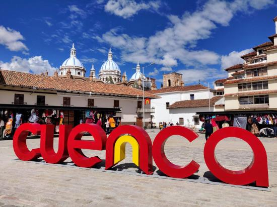
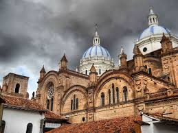

# Practica01-MiBlog
<!DOCTYPE html>
<html lang="es">

<head>
    <meta charset="UTF-8">
    <meta http-equiv="X-UA-Compatible" content="ie=edge">
    <title>Cuenca dice</title>
    <meta name="viewport" content="width=device-width, initial-scale=1" />
    <link href="ct_base.css" rel="stylesheet" />
    <link href="ct_layout1.css" rel="stylesheet" />
</head>

<body>
    <header>
        

    </header>

    <nav>
        <ul>
            <li> <a href="index.html"> Inicio </a> </li>

            <li> <a href="Seryhacer/ct_somos.html"> Mision-Vision </a></li>

            <li> <a href="Contactanos/ct_contactos.html"> Contactos </a> </li>

            <li> <a href="Cuenca/ct_lugares.html"> Lugares de interes </a> </li>

            <li> <a href="Cuenca/ct_cultura.html"> Cultura </a> </li>

            <li> <a href="Noticias/ct_noticias.html"> Ultimas noticias </a> </li>

            <li> <a href="Noticias/ct_opinion.html"> Opinion </a> </li>

        </ul>
    </nav>

    <section>
        <header>
            <h1> Un poco de la ciudad de Cuenca </h1>
        </header>
        <ol>
            <li> <a href="#C1"> Informacion general:</a> </li>
            <li> <a href="#C2"> Datos de interes:</a> </li>
            <li> <a href="#C3"> Geografia:</a> </li>

        </ol>
        <article>
            <h3 id="C1">Informacion general</h3>
            <iframe width="800" height="315" src="https://www.youtube.com/embed/tMbp2q2J-5g"> </iframe>

            
Cuenca(capital del estado Azuay),es una ciudad al sur de la Republica de Ecuador
                .Esta ciudad cuenta con 4 rios ,los cuales la caracterizan llamados : <em> Tomebamba,Tarqui,Yanuncay
                    y Machangara </em> .La nombran la <strong> "La Atenas del Ecuador "</strong> debido a su cuna
                de grandes artistas ,en el area de las letras y el arte fundamentalmente

            

                Esta hermosa ciudad fue fundada el 12 de abril de 1557 por el conquistador Gil Ramirez Davalos
                Durante el siglo XX se mantuvo en un auge crecimiento en la educacion y cultura ,tanto asi
                que nombraron su concurrido centro historico <b>"Patrimonio Cultural de la Humanidad"</b> Asi
                hasta nuestros dias se ha establecido como uno de los mayores destinos turisticos del Ecuador.
            

        </article>

        <aside>

            

            <a href="https://ecuador.travel/es/destinos/andes/cuenca/">Referencia</a>
        </aside>

        <article>
            <h3 id="C2">Datos de interes</h3>

            
 Conocer algunos de los datos representativos le hara adentrarse y apropiarse de la
                cultura de esta ciudad.Aqui les dejo algunos:
            

            <ol>
                <li>Idioma español</li>
                <li>Alcalde :Pedro Palacios</li>
                <li>Cuenta con 15 parroquias urbanas</li>
                <li>Lema:Primero Dios y despues Vos</li>
                <li>Gentilicio :Cuencano</li>
                <li>Fundacion :12 de abril</li>
                <li>Independencia:3 de noviembre</li>
                <li>Prefijo telefonico:593 7</li>
                <li>Region:Sierra</li>
            </ol>

            
        </article>

        <article>
            <h3 id="C3">Geografia</h3>
            
            
 Cuenca se encuentra en la <b><i>Region Interandina del Ecuador </i></b>,se divide en tres terrazas
                y en dos partes por el rio Tomebamba .Tambien equidista a 432 km hacia <em>Quito</em> y 191 km hacia
                <em>Guayaquil</em>.

            <h4>Clima:</h4>
            <table border="1" >
                <caption>Temperaturas en Cuenca</caption>
                <colgroup>
                    <col style="width: 20%" />
                    <col style="width: 40%" />
                    <col style="width: 40%" />
                </colgroup>
                <thead>
                    <tr>
                        <th rowspan="2"> </th>
                        <th colspan="2">Parametros climaticos de dos meses</th>
                    </tr>
                    <tr>
                        <th>Septiembre</th>
                        <th>Octubre</th>
                    </tr>
                </thead>

                <tbody>
                    <tr>
                        <th>Temperatura maxima</th>
                        <td>13°C - 16°C</td>
                        <td>14°C - 16°C</td>
                    </tr>

                    <tr>
                        <th>Temperatura minima</th>
                        <td>7°C - 9°C</td>
                        <td>8°C - 9°C</td>
                    </tr>
                </tbody>
                
                <tfoot>
                    <tr>
                        <td colspan="3">Promedio.</td>
                    </tr>
                </tfoot>

                
            </table>

        </article>

    </section>

    <section>
        <header>
            <h3>Conoceme a mi-conoce a la pagina</h3>
            <ol>
                <li> <a href="#C4"> Conoceme:</a> </li>
                <li> <a href="#C5"> ¿Que vas a encontrar en la pagina?</a> </li>
                <li> <a href="#C6"> Recomendaciones:</a> </li>

            </ol>
        </header>

        <article>
            <h3 id="C4">Conoceme</h3>
            
 Yo soy Helen Companioni Vargas ,estudio Computacion en la Universidad Politecnica Salesiana.
                Esta pagina web surgio por una practica de la materia Programacion Hipermedial que se asigno ,
                a realizar en un periodo de tiempo 

            
            

                Me encanto escoger el tema Cuenca ,porque aparte de ser la ciudad donde vivo ,seria ideal llevar
                informacion certera y concreta a la poblacion cuencana.Los niños,jovenes,adultos y ancianos tienen
                la necesidad de mantenerse actualizados con noticias de su interes tanto directa o indirectamente.
                Por eso me mueve hacer una web informativa real y sin mascaras asi como los cuencanos.
            

        </article>

        <article>
            <h3 id="C5">¿Que vas a encontrar en la pagina?</h3>

            

                
                Cuenca es una ciudad con mucos medios de comunicacion tanto cadenas de televicion y
                en mayor numero las fanpage de facebook ,que es el medio que llega a mas personas para
                mantenerlos actualizados ,con las coticias mas relevantes del momento.
                 
                En esta pagina vas a encontar no solo noticias actuales de como se esta moviendo la ciudad
                sino ,voy a plasmar aspectos culturales ,lugares de interes ,mi opinion a diversas situaciones
                que esten ocurriendo en la ciudad y mas adelante recomendaciones de hoteles y reseñas de lugares ,
                para que te sea facil elegir entre tantas opciones novedosas en la ciudad y no gastes tu dinero
                en vano.
                 
                Espero que puedas aprender, nutrirte y crezcas como ser humano que esto ultimo es lo mas importante
                ,sino nada valdria la pena.
            

        </article>

        <article>
            <h3 id="C6">Recomendaciones</h3>
            

                Para la realizacion de esta pagina he utilizado muchas herramientas que de una forma didactica me han
                ayudado
                en conceptos o ver como funcionan algunas de las etiquetas ,entre muchas mas inquietudes.
            

            <ul>
                <li> <a href="https://www.w3schools.com"> W3schools </a></li>

                <li> <a href="https://www.youtube.com/watch?v=cqMfPS8jPys"> Curso basico html </a></li>
                <li> <a href="https://developer.mozilla.org/es/"> Ver como utilizar etiquetas </a></li>
                <li> <a href=" http://www.allitebooks.org/new-perspectives-html5-and-css3-7th-edition/"> Libro Html</a>
                </li>
                <li> <a href=" http://thecodeplayer.com"> Bases en html</a></li>
            </ul>

            

        </article>

    </section>

    <footer>
        <b>Cuenca Dice</b>
         
        Helen Companioni Vargas
         
        Estudiante de la Universidad Politecnica Salesiana
         
        email :<a href="mailto:helencv1997@gmail.com?Subject=Hello%20again">Send mail!</a>

        phone :<a href="tel:+593992726928">0992726928</a>

         Todos los derechos reservados
    </footer>

</body>

</html>

<!DOCTYPE html>
<html lang="es">

<head>
    <meta charset="UTF-8">
    <meta http-equiv="X-UA-Compatible" content="ie=edge">
    <title>Ultimas noticias</title>
    <meta name="viewport" content="width=device-width, initial-scale=1" />
    <link href="ct_base.css" rel="stylesheet" />
    <link href="ct_layout1.css" rel="stylesheet" />
</head>

<body>
    <header>
        

    </header>

    <nav>
        <ul>
            <li><a href="../index.html"> Inicio </a></li>

            <li> <a href="../Seryhacer/ct_somos.html"> Mision-Vision </a></li>

            <li> <a href="../Contactanos/ct_contactos.html"> Contactos </a></li>

            <li> <a href="../Cuenca/ct_lugares.html"> Lugares de interes </a></li>

            <li> <a href="../Cuenca/ct_cultura.html"> Cultura </a></li>

            <li> <a href="ct_noticias.html"> Ultimas noticias </a></li>

            <li> <a href="ct_opinion.html"> Opinion </a></li>

        </ul>
    </nav>

    <section>
        <header>
            <h1> Paro en Ecuador</h1>

            <ol>
                <li> <a href="#C1"> Ir a Moreno anuncia medidas y reformas: , </a> </li>
                <li> <a href="#C2"> Pronunciamiento del secretario de la Presidencia(Juan Roldan): , </a> </li>
                <li> <a href="#C3"> Impacto de las medidas economicas: , </a> </li>
                <li> <a href="#C4"> Pedro Palacios anuncia a Cuenca como estado de emergencia: , </a> </li>
            </ol>
        </header>

        <article>
            <h2 id="C1">Moreno anuncia medidas y reformas</h2>
            

                

                Moreno el martes 1 de octubre anuncio al pais <i>medidas economicas</i>.Lo primero que anuncio es que no
                subira el iva ,se mantendra
                en el valor del 12%.Ademas de que bajara impuestos con para posibilitar que la economia se dinamice.
            

            
                <ul>
                    <li>Manifesto que aquellas empresas que tinene ingresos con mas de 10 millones al año ,pagaran por
                        tres años una constribucion especial
                        que distribuira para educacion,seguridad y salud.</li>

                    <li> El pais destina <strong> mas de 1 300 millones de dolares al año </strong> al subsidio al
                        diesel.En America el unico pais que cuenta con este subsidio
                        es Venezuela,con esto elimina el subsidio y dijo que esos recursos se van a destinar a salud
                        ,educacion y vivienda.Y añade 300 familias
                        al millon que reciben bonos.(15 dolares mensuales).</li>

                    <li>Gobernadores podran hacer controles a comerciantes.</li>

                    <li>Elimina o reduce aranceles para equipos ,maquinaria y materia prima.</li>

                    <li>Suprime los impuestos a telefonos celulares ,tablet y computadoras.</li>

                    <li> Elimina el anticipo de impuesto a la renta.</li>

                    <li>Reduce a la mitad el impuesto a la divisa de salida de materias primas,insumos y bienes
                        capitales.</li>

                    <li> Aumenta <em>1000 millones de dolares </em> a los creditos hipotecarios.</li>

                    <li>Bajar el impuesto a los vehiculos de menos de 32 000 dolares.</li>

                    <li>Contratos con menos de un 20 % de remuneracion.</li>

                    <li>Vacaciones del sector publico se reduce a <b>15 dias </b>.</li>

                    <li>Los trabajadores publicos aportaran con un dia de su salario.</li>

                </ul>

                Con estas medidas asegura un futuro prospero para el Ecuador.

                <h2>Aqui les dejo una tabla de como estarian los precios del subsidio (con y sin):</h2>
            

        
                <table border="1">
                    <caption>Temperaturas en Cuenca</caption>
                    <colgroup>
                        <col style="width: 20%" />
                        <col style="width: 40%" />
                        <col style="width: 40%" />
                    </colgroup>
                    <thead>
                        <tr>
                            <th rowspan="2"> </th>
                            <th colspan="2">Parametros de subsidio a Gasolina</th>
                        </tr>
                        <tr>
                            <th>Con Subsidio</th>
                            <th>Sin Subsidio</th>
                        </tr>
                    </thead>

                    <tbody>
                        <tr>
                            <th>Eco Pais (extra con etanol)</th>
                            <td>1,45</td>
                            <td>2,53</td>
                        </tr>
                        <tr>
                            <th>Super</th>
                            <td>2,30</td>
                            <td>3,07</td>
                        </tr>
                    </tbody>

                    <tfoot>
                        <tr>
                            <td colspan="3">Fuente: EP Petroecuador.</td>
                        </tr>
                    </tfoot>

                </table>
            
        </article>

        <article>
            <h2 id="C2">Pronunciamiento del secretario de la Presidencia(Juan Roldan)</h2>

            

                

                El miercoles se pronuncio el ministro Roldan,para reafirmar lo anunciado por el presidente Moreno.
                Dijo que esta decision tiene que ver con romper con distorciones que el Ecuador ha mantenido por mas de
                40
                años ,ya que ningun gobiernos antes habia hecho esto.Los subsidio aclaro que habian sumado millones de
                dolares
                que estaban beneficiando a quienes no lo necesitaban.Ratifico que estas medidas llevaran a la democracia
                y la libertad.
            

        </article>

        <article>
            <h2 id="C3"> Impacto de las medidas economicas </h2>

            

                

                El pais luego de 48 h de establecidas las medidas.Se han levantado los transportistas ,los estudiantes y
                los ciudadanos
                a protestar ,a bloquear vias ,a no trabajar .El pais se vio parado en los trabajo ,las universidades
                ,las fabricas (los empleados
                no podian trasladarse),la entrada de alimentos por las vias bloqueadas ,entre muchas mas.Tambien se ha
                desatado un conflicto
                interno en las provincias contra las fuerzas armadas por estas medidas.
                Ademas de las protestas ultimamente protagonizadas por los indigenas del Ecuador ,que exigen un bien
                comun.
            

        </article>

        <article>
            <h2 id="C4"> Pedro Palacios anuncia a Cuenca como estado de emergencia</h2>

            

                

                Debido al paro Nacional ,el alcalde de la capital del Azuay <b>Pedro Palacios</b> declara a Cuenca en
                estado de
                emergencia ,ya que la ciudad se ha visto muy afectada ,daños tanto en la ciudad ,como en las personas.El
                alcalde
                pretende poner en marcha planes para resguardar las edificaciones que son patrimonio nacional ,asi como
                poder llegar
                a un acuerdo son los servicios publicos ,para que funcionen sin ninguna alteracion.
                Tambien declara la ayuda brindana por los ciudadanos para limpiar el centro historico de Cuenca.

                <iframe width="560" height="315" src="https://www.youtube.com/embed/SypZXkaYR6M"> </iframe>

            

        </article>

        <aside>

            <a
                href="https://www.eluniverso.com/noticias/2019/10/01/nota/7543372/presidente-lenin-moreno-anunciara-medidas-economicas-20h00-durante">Referencia1</a>
            <a
                href="https://www.elcomercio.com/actualidad/entrevista-juansebastianroldan-instancias-laudo-chevron.html">Referencia2</a>
            <a
                href="https://www.notimerica.com/politica/noticia-ecuador-alcalde-ciudad-ecuatoriana-cuenca-declara-emergencia-marco-protestas-20191011062246.html">Referencia3</a>

        </aside>
    </section>

    <section>
        <header>
            <h1> Noticias Internacionales</h1>

            <ol>
                <li> <a href="#C5"> Turquia agudiza su situacion fronteriza:</a> </li>
                <li> <a href="#C6"> McAleenan sale de la Seguridad Nacional de los EEUU:</a> </li>
                <li> <a href="#C7"> Ministro etiope ,Premio Nobel de la Paz:</a> </li>
            </ol>
        </header>
        <article>
            <h2 id="C5"> Turquia agudiza su situacion fronteriza</h2>

            

                

                Turquia mantiene su contra ataque hacia las ciudades fronterizas.Los kurdos(combatientes ) se hacen de
                esta situacion,
                se ha desarrollado un tanto fuerte en <b>Tel Abyand</b> (una poblacion siria) es a sede de los
                principales enfrentamientos.
                Ha sido tan grave que en la poblacion de <b>Qamishli</b> ha ocurrido un atentado con coche bomba,(que
                supuestamente esto provoco
                el estado islamico).Esto ha desencadenado un choque entre Turquia y naciones de Europa.
            

        </article>

        <article>
            <h2 id="C6">McAleenan sale de la Seguridad Nacional de los EEUU</h2>

            

                

                El mandatario Donald Trump declara que el secretario McAleenan sale de cargos porque desea pasar mas
                tiempo con su familia
                y desarrollarse en el sector privado.Trump agradece por sus servicios para EEUU ,por estar en la cabeza
                de la politica
                migratoria en dicho pais.McAleenan redujo los cruces ilegales a EEUU ,haciendo lazos con otras naciones
                para combatir
                el trafico de personas.
            

        </article>
        <h2 id="C7"> Ministro etiope ,Premio Nobel de la Paz</h2>

        

            

            Abiy Ahmed fue premiado por su lucha incansable por lograr una paz entre Etiopia y Eritrea ,los cuales
            llevaban un
            conflicto desde 1990 y que cobro mas de 60 000 vidas.Ahmed tras un tiempo de ser elegido libero a presos
            politicos ,
            , elimino el estado de emergencia y su mas importante o relevante el de firmar acuerdo de paz con Eritrea.

        

        <aside>

            <a
                href="https://cnnespanol.cnn.com/2019/10/11/renuncia-kevin-mcaleenan-como-secretario-interino-del-departamento-de-seguridad-nacional/">Referencia1</a>
            <a href="https://elpais.com/internacional/2019/10/11/actualidad/1570776411_195083.html">Referencia2</a>

        </aside>

    </section>

    <footer>
        <b>Cuenca Dice</b>
         
        Helen Companioni Vargas
         
        Estudiante de la Universidad Politecnica Salesiana
         
        email :<a href="mailto:helencv1997@gmail.com?Subject=Hello%20again">Send mail!</a>
         
        phone :<a href="tel:+593992726928">0992726928</a>

         Todos los derechos reservados
    </footer>

</body>

</html>

<!DOCTYPE html>
<html lang="es">
<head>
    <meta charset="UTF-8">
    <meta http-equiv="X-UA-Compatible" content="ie=edge">
    <title>MisionyVision</title>
    <meta name="viewport" content="width=device-width, initial-scale=1" />
   <link href="ct_base.css" rel="stylesheet" />
   <link href="ct_layout1.css" rel="stylesheet" />
</head>
<body>
    <header>
        
       
     </header>

     <nav>
        <ul>
       <li> <a href="../index.html"> Inicio </a> </li>
       
       <li> <a href="ct_somos.html"> Mision-Vision </a> </li>
       
        <li> <a href="../Contactanos/ct_contactos.html"> Contactos </a> </li>
       
        <li> <a href="../Cuenca/ct_lugares.html"> Lugares de interes </a> </li>
       
        <li> <a href="../Cuenca/ct_cultura.html"> Cultura </a> </li>
       
        <li> <a href="../Noticias/ct_noticias.html"> Ultimas noticias </a> </li>
       
        <li> <a href="../Noticias/ct_opinion.html"> Opinion </a> </li>
       
        </ul>
     </nav>
      
     <section>
            <h1> Mision-Vision:</h1>
         <article>
                <h2> Conceptos:</h2>
                
                
               
               
            <h2> Mision:</h2>
            
                

                <b> Concepto de mision:</b> Que se puede hacer para lograr la vision.
                Mi mision para <b> "Cuenca dice" </b> es formar un grupo de personas
                con la misma vision que yo ,que junto con sus habilidades profesionales
                se logre una plataforma versatil.

                

            
                 <h2> Vision:</h2>

                 

                   <b>Concepto de vision:</b> La vision es el punto de partida y como nos vemos en un largo plazo.
                   Mi vison para <b> "Cuenca dice</b> es llegar a ser un referente nacional de 
                   informacion veridica para cada ecuatoriano.
                 

         </article>

         <aside>
             <a href="https://www.entrepreneur.com/article/294059">Referencia</a>
         </aside>
     </section>
 
   

     <footer>
            <b>Cuenca Dice</b> 
            
           Helen Companioni Vargas
            
           Estudiante de la Universidad Politecnica Salesiana
            
           email :<a href="mailto:helencv1997@gmail.com?Subject=Hello%20again">Send mail!</a>
            
           phone :<a href="tel:+593992726928">0992726928</a>
       
          Todos los derechos reservados
       </footer>
   
    </body>
    </html>
    
    
    
    
    
    
    
    
    
    
    
    
    
    
    
    
    
    
    
    
    
    
    
    
    
    
    
    
    
    
    
    
    
    
    <!DOCTYPE html>
<html lang="es">
<head>
    <meta charset="UTF-8">
    <meta http-equiv="X-UA-Compatible" content="ie=edge">
    <title>Cultura</title>
    <meta name="viewport" content="width=device-width, initial-scale=1" />
   <link href="ct_base.css" rel="stylesheet" />
   <link href="ct_layout1.css" rel="stylesheet" />
</head>
<body>
    <header>
        
       
     </header>

     <nav>
        <ul>
        <li><a href="../index.html"> Inicio </a> </li>
        
        <li> <a href="../Seryhacer/ct_somos.html"> Mision-Vision </a> </li>
        
       <li> <a href="../Contactanos/ct_contactos.html"> Contactos </a> </li>
        
        <li> <a href="ct_lugares.html"> Lugares de interes </a> </li>
       
        <li> <a href="ct_cultura.html"> Cultura </a> </li>
       
        <li> <a href="../Noticias/ct_noticias.html"> Ultimas noticias </a> </li>
      
        <li> <a href="../Noticias/ct_opinion.html"> Opinion </a> </li>
       
        </ul>
     </nav>
  
     <section>
            <h1>Tradiciones en Cuenca:</h1>
         <article>
            <h2>Cultura:</h2>
            

                Cuenca es una de las ciudades cunas de la cultura en el pais .Esta ciudad es llamada <b>"Cuenca de los Andes"</b> o la 
                <b>"Atenas del Ecuador"</b> ,por ser la tierra de artistas o personalidades como :Miguel Velez,Gaspar Sangurima,Remigio 
                Crespo Toral,Abdon Calderon,entre otros.
           
                

            

            <b>CIDAP</b>
            El CIDAP es un centro de artesanias y y arte en general ,que se creo con el proposito de preservar la cultura latinoamericana y como
            un tratado entre los paises que integran la OEA.
            

        
           <b>Fiestas Populares en Cuenca:</b>

           
 
               <b>Santos Inocentes:</b>
               Se celebra el 6 de enero de todos los años.Esta fiesta en sus comienzos era religiosa ,con el pasar de los años 
               se fueron incorporando cosas no tan reliosas,y todos lo celebran.Se hacen comparsas ,defiles y se premian los mismos.
           

            

       
            <b>Carnaval de Cuenca:</b>
             El carnaval es un momento en Cuenca que todos aprovechan para reunirse con su familia y disfrutar de unos platos tipicos
             de la ciudad como el chancho ,el cuy .Tambien se eligen los compadres y comadres.
          

            

         
            <b>Corpus Christi:</b>
            El Corpus es una de las fiestas mas famosas que se celebran en la ciudad.La sede se encuentra en el parque "Abdon Calderon" 
            ,donde  se llena de puestos de muchas fabricantes de dulces,que durante una semana alegran la vida del cuencano y foraneo
            en la ciudad.
      

          

   
            <b>Pase del niño viajero:</b>
            Esta tradiccion manifiesta la cultura y las creencias.Celebran el nacimiento al niño Dios.Las personas se disfrazan con 
            ropa elegante (especialmente hecha a bordados).Los cuencanos van voluntariamente a esta celebracion con sus familias.

            

           

            </article>

            <aside>
              <a href="http://cuenca.com.ec/es/fiestas-populares">Referencia</a>
            </aside>
     </section>

    

     <footer>
            <b>Cuenca Dice</b> 
            
           Helen Companioni Vargas
            
           Estudiante de la Universidad Politecnica Salesiana
            
           email :<a href="mailto:helencv1997@gmail.com?Subject=Hello%20again">Send mail!</a>
            
           phone :<a href="tel:+593992726928">0992726928</a>
      
          Todos los derechos reservados
       </footer>
   
</body>
</html>

<!DOCTYPE html>
<html lang="es">
<head>
    <meta charset="UTF-8">
    <meta http-equiv="X-UA-Compatible" content="ie=edge">
    <title>Lugares de interes</title>
    <meta name="viewport" content="width=device-width, initial-scale=1" />
   <link href="ct_base.css" rel="stylesheet" />
   <link href="ct_layout1.css" rel="stylesheet" />
</head>
<body>
    <header>
        
       
     </header>

     <nav>
        <ul>
        <li><a href="../index.html"> Inicio </a> </li>
       
        <li> <a href="../Seryhacer/ct_somos.html"> Mision-Vision </a> </li>
        
        <li> <a href="../Contactanos/ct_contactos.html"> Contactos </a> </li>
       
        <li> <a href="ct_lugares.html"> Lugares de interes </a> </li>
       
        <li> <a href="ct_cultura.html"> Cultura </a> </li>
        
        <li> <a href="../Noticias/ct_noticias.html"> Ultimas noticias </a> </li>
       
        <li> <a href="../Noticias/ct_opinion.html"> Opinion </a> </li>
        
        </ul>
     </nav>
  
     <section>
        <h1>Lugares de interes en Cuenca:</h1>
         <article>
            <h2>Lugares:</h2>
            

              <b> Catedral de Cuenca:</b>
              La Catedral se ubica en Mariscal Sucre,Benigno Malo,Cuenca.Esta es una iglesia <strong>catolica</strong> de estilo renacentista(gotico) 
              se construyo durante un periodo de 100 años y cada dia abre sus puertas a multiples turistas y devotos de la ciudad.

               
               
           

              <b> Parque Nacional Cajas:</b>
              El parque Cajas es una zona protegida ubicada en los <strong>Andes(sur)</strong>.Cuenta con una rica diversidad en flora y fauna ,como:bosque 
              de neblina montano alto ,orquideas ,helechos ,musgos,venados de cola blanca ,oso de anteojos ,puma ,llama ,tucan,entre otros.
              De Cuenca toma aproximadamente 40 min llegar a este lugar.Tambien cuenta con senderos y la posibilidad de que puedas
              acampar ,senderismo ,pesca deportiva y escalada.

              
              
            

              <b>Catedral vieja de Cuenca:</b>
              La Catedral vieja esta ubicada en la Calle Luis Cordero.Fue la sede en el siglo XVI para que los españoles hicieran
              su culto,pero hoy en dia funciona como museo de arte religioso.Ademas es Patrimonio de la Humanidad de la Unesco.

             
              
           

              <b>Museo Pumapungo:</b>
              El Museo esta ubicado en calle Larga.Este lugar es Patrimonio Cultural de la Humanidad.En este lugar podemos encontrar 
              arte,arqueologia,audiovisuales,esculturas,lugares del Ecuador,comunidades del Ecuador por provincias,un mini zoologico (donde
              se encuentran algunas especies de aves).

            
            
        

            <b>Mirador El Turi:</b>
            El mirador se encuentra al oeste de Cuenca.Desde este lugar podemos apresiar la ciudad en tu totalidad.Este lugar cuenta 
            con una iglesia llamada <b>Nuestra Señora de la Merced</b>,tambien cuenta con un pequeño parque ,que cuenta con un columpio,
            cuerdas y otras actividades recreativas.

            
            
       

            <b>Museo del Sombrero de Paja Toquilla:</b>
            Este museo se ubica en Padre Aguirre y Calle Larga.Este lugar tiene mucha importancia ,aqui se fabrica el sombrero de paja Toquilla
            ,producto 100% ecuatoriano.Este sombrero se hace a mano por artesanos ecuatorianos y es un producto digno de conocer y comprar.
        

        

  
            

            
            </article>

            <aside>
            <a href="https://www.tripadvisor.co/Attractions-g294309-Activities-Cuenca_Azuay_Province.html">Referencia</a>
            </aside>
     </section>

   

     <footer>
            <b>Cuenca Dice</b> 
            
           Helen Companioni Vargas
            
           Estudiante de la Universidad Politecnica Salesiana
            
           email :<a href="mailto:helencv1997@gmail.com?Subject=Hello%20again">Send mail!</a>
            
           phone :<a href="tel:+593992726928">0992726928</a>
      
          Todos los derechos reservados
       </footer>
   
</body>
</html>

<!DOCTYPE html>
<html lang="es">
<head>
    <meta charset="UTF-8">
    <meta http-equiv="X-UA-Compatible" content="ie=edge">
    <title>Opinion</title>
    <meta name="viewport" content="width=device-width, initial-scale=1" />
   <link href="ct_base.css" rel="stylesheet" />
   <link href="ct_layout1.css" rel="stylesheet" />
</head>
<body>
    <header>
        
       
     </header>

     <nav>
        <ul>
        <li><a href="../index.html"> Inicio </a></li>
       
        <li><a href="../Seryhacer/ct_somos.html"> Mision-Vision </a></li>
       
        <li><a href="../Contactanos/ct_contactos.html"> Contactos </a></li>
       
        <li><a href="../Cuenca/ct_lugares.html"> Lugares de interes </a> </li>
       
        <li><a href="../Cuenca/ct_cultura.html"> Cultura </a> </li>
       
        <li><a href="../Noticias/ct_noticias.html"> Ultimas noticias </a> </li>
       
        <li> <a href="ct_opinion.html"> Opinion </a> </li>
       
        </ul>
     </nav>
  
     <section>
            <h2>Opiniones:</h2>
         <article>
                <h2>La situacion en Ecuador:</h2>
            

                 
            
                Ecuador e estos momentos se encuentra en una situacion no tan positiva ,ni tan agradable.Por las medidas impuestas 
                por el presidente de la Repuplica de Ecuador ,Lenin Moreno ,se ha desatado en el pais un caos total.Primero que todo 
                no quiero hablar de politica ,solo quiero dar un comunicado al pueblo ecuatoriano y los extranjeros presentes en esta nacion.
           
                A lo mejor tu te encuentras en la parte de la sociedad que de cierta manera estas medidas que se han tomado te afecta.
                A lo mejor tu eres el obrero que se levanta todos los dias temprano para trabajar ,cuidar de tu familia ,alimentarles
                y proveerles lo necesario.
                A lo mejor eres el estudiante que se translada todos los dias en unidades del transporte y teme por la subida de las tarifas 
                en buses ,taxis y buses provinciales.
            
                Y te puedo entender ,aveces es dificil adaptarse a los cambios ,y mas que se adapte tu bolsillo,tus deudas ,tus gastos ,entre 
                muchas cosas mas.Pero te digo algo las personas que viven en Ecuador ,merecen libertad ,merecen tranquilidad y merecen una optima 
                calidad de vida ,y te hablo de esto porque yo vivo en una parte de la ciudad que se vio muy afectada.Yo no sabia lo que era el gas 
                lacrimogeno hasta hace unos dias atras ,y es desagradable ,espantoso ,nunca habia presenciado casi una guerra;donde no puedes salir
                de tu casa ,porque tienes miedo por tu vida,por tu salud.
            
                Quiero llamarte a algo!!!
                Puedes protestar ,puedes ,claro que puedes ,hay libertad para que lo hagas ,pero no violentes tu ciudad y a las personas que 
                viven en ella.Protesta sin violencia,sin agresion ,pacificamente,porque lo unico que haces el denigrarte y pues eso no te gustaria.
                Piensa en los niños ,jovenes y adolescentes que estan creciendo viendo esto ,trata de hacer un cambio ,sin hacer daño.
                Todo un pais quiere progresar ,pero a lo bien.
            

            </article>

            <aside>
             <a href="https://www.eluniverso.com/noticias/2019/10/11/nota/7555877/paro-ecuador-que-se-sabe-este-viernes-11-octubre">Referencia</a>
            </aside>
     </section>

    

     <footer>
            <b>Cuenca Dice</b> 
            
           Helen Companioni Vargas
            
           Estudiante de la Universidad Politecnica Salesiana
            
           email :<a href="mailto:helencv1997@gmail.com?Subject=Hello%20again">Send mail!</a>
            
           phone :<a href="tel:+593992726928">0992726928</a>
      
          Todos los derechos reservados
       </footer>
   
</body>
</html>

<!DOCTYPE html>
<html lang="es">
<head>
    <meta charset="UTF-8">
    <meta http-equiv="X-UA-Compatible" content="ie=edge">
    <title>Contactos</title>
    <meta name="viewport" content="width=device-width, initial-scale=1" />
   <link href="ct_base.css" rel="stylesheet" />
   <link href="ct_layout1.css" rel="stylesheet" />
</head>
<body>
    <header>
        
       
     </header>

     <nav>
        <ul>
        <li><a href="../index.html"> Inicio </a> </li>
        
        <li><a href="../Seryhacer/ct_somos.html"> Mision-Vision </a> </li>
        
        <li> <a href="ct_contactos.html"> Contactos </a> </li>
        
        <li> <a href="../Cuenca/ct_lugares.html"> Lugares de interes </a> </li>
        
        <li> <a href="../Cuenca/ct_cultura.html"> Cultura </a> </li>
        
        <li> <a href="../Noticias/ct_noticias.html"> Ultimas noticias </a> </li>
        
        <li> <a href="../Noticias/ct_opinion.html"> Opinion </a> </li>
        
        </ul>
     </nav>
  
     <section>
            <h1>Contactos:</h1>
         <article>
              <h2>Redes Sociales:</h2>
                
             
             

                 
                 <b>Instagram:</b> helencompanioni ,
                 <b>Facebook:</b> helencompanioni , 
                 <b>Twiter:</b> helencompanioni ,
             
            Si quisieras colaborar conmigo con informacion ,podrias escribirme al correo que se uncuentra en el
            pie de la pagina.
             

         </article>

         <aside>
             
             <a href="https://www.facebook.com/helencompanioni" > Facebook</a> ,
             <a href="https://www.instagram.com/helencompanioni"> Instagram </a>
         </aside>
     </section>

    

     <footer>
            <b>Cuenca Dice</b> 
            
           Helen Companioni Vargas
            
           Estudiante de la Universidad Politecnica Salesiana
            
           email :<a href="mailto:helencv1997@gmail.com?Subject=Hello%20again">Send mail!</a>
            
           phone :<a href="tel:+593992726928">0992726928</a>
    
              Todos los derechos reservados
       </footer>
   
</body>
</html>

Etiquetas utilizadas:
<!Doctype>       Definen un documento html
<a>                   Define un hipervínculo
<article>            Define un articulo
<aside>             Define el contenido lateral de una pagina
<b>                   Define texto en negrita
<body>             Define el cuerpo de un documento
                  Define un salto de línea
<em>                 Define un énfasis en un texto
<footer>             Define el pie de pagina
<h1>                  Define un encabezado
<head>              Define información acerca del documento
<header>           Define la sección del encabezado
<html>                Define la raíz del documento
<i>                      Define parte del documento en modo alternativo
<imag>               Define una imagen
<nav>                Define links de navegación
<ol>               Lista ordenada
<ul>                Lista desodenada

                define párrafo
<section>       Define una sección de un documento
<strong>        Texto en negrita
<table>            Define una tabla
<tbody>          Cuerpo de una tabla
<td>               Define una celda
<tr>               Define una fila
<meta>         Define el metadato de un documento
<li>               Define ítem de una lista
<iframe>       Define un frame en una línea (se utilizo para ponder un video de youtube

e.Practica01-Blog
Usuario:HelenCVM
Link: https://github.com/HelenCVM/Practica01-MiBlog.git

f.Tutorial1
Link:

CONCLUSIONES:
Con la realización de esta práctica pude repasar la estructura(HTML) vista en clase ,las etiquetas que se pueden utilizar para imágenes ,texto ,videos ,entre otras y reafirmar conocimientos,para poder crear sitios web sencillos y comprender el código de otras paginas.

RECOMENDACIONES:
W3school

    
    
    
    
